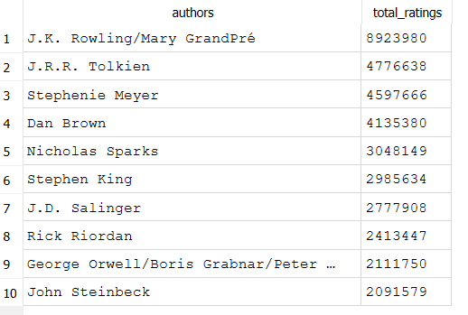
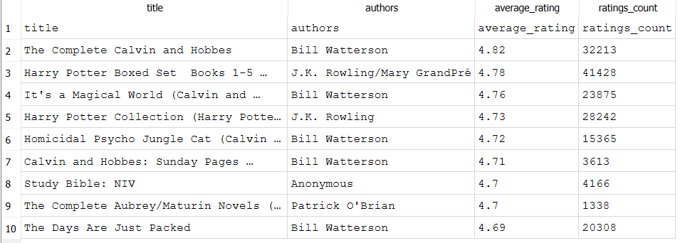

# Goodreads SQL Project

This project explores a dataset of 11,000+ books from Goodreads using SQL. The goal is to analyze book popularity, author trends, and language patterns through a series of queries.

---

## Tools
SQLite (via DB Browser), Goodreads dataset (Kaggle), Windows, Markdown

## SQL Features Used
SELECT, FROM, WHERE, GROUP BY, HAVING, ORDER BY, LIMIT, LIKE,
Aggregate functions: COUNT(), SUM(), AVG()

##Questions
1. **Who are the top 10 most popular authors by total number of ratings received?**  
2. **What are the top 10 highest-rated books that have received more than 1,000 ratings?**  
3. **Which authors have written the most books in the dataset?**  
4. **What is the average number of pages for books in the dataset?**  
5. **Which authors have published at least 5 books, and what is their average rating?**  
6. **Which books in the dataset are part of the Harry Potter series?**


## Query 1: Top Authors by Total Ratings

**Question:**  
Who are the top 10 most popular authors by total number of ratings received?

**Explanation:**  
This query adds up the `ratings_count` for each author to measure overall popularity based on reader engagement.

**SQL:**
```sql 
SELECT 
  authors, 
  SUM(ratings_count) AS total_ratings
FROM 
  books
GROUP BY 
  authors
ORDER BY 
  total_ratings DESC
LIMIT 10;
```


## Output



## Query 2: Top-Rated Books (with 1,000+ Ratings)

**Question:**  
What are the top 10 highest-rated books that have received more than 1,000 ratings?

**Explanation:**  
This query filters out books with very few ratings, which can be unreliable or skewed. It focuses on books with over 1,000 ratings, then sorts by `average_rating` to identify consistently well-reviewed titles.

**SQL:**
```sql
SELECT 
  title, 
  authors, 
  average_rating, 
  ratings_count
FROM 
  books
WHERE 
  ratings_count > 1000
ORDER BY 
  average_rating DESC
LIMIT 10;
```

## Output



## Query 3: Most Prolific Authors

**Question:**  
Which authors have written the most books in the dataset?

**Explanation:**  
This query counts how many books each author has in the dataset, helping identify the most prolific writers. It uses `COUNT(*)` to tally books per author and ranks them from highest to lowest.

**SQL:**
```sql
SELECT 
  authors, 
  COUNT(*) AS num_books
FROM 
  books
GROUP BY 
  authors
ORDER BY 
  num_books DESC
LIMIT 10; 
```


## Query 4: Average Number of Pages

**Question:**
What is the average number of pages for books in the dataset?

**Explanation:**
This query calculates the average length of books using the num_pages column. It gives a general sense of how long the books are on average in this dataset.

**SQL:**
```sql
SELECT 
  AVG(num_pages) AS average_page_count
FROM 
  books;
```

## Query 5: Highest-Rated Authors (With at Least 5 Books)

**Question:**
Which authors have published at least 5 books, and what is their average rating?

**Explanation:**
This query identifies authors with five or more books in the dataset and ranks them by their average rating. It uses GROUP BY to aggregate ratings per author and HAVING to filter for those with at least 5 books — a clause not usable with WHERE.

**SQL:**
```sql
SELECT 
  authors, 
  COUNT(*) AS num_books,
  AVG(average_rating) AS avg_rating
FROM 
  books
GROUP BY 
  authors
HAVING 
  num_books >= 5
ORDER BY 
  avg_rating DESC
LIMIT 10;
```

## Query 6: Find All Harry Potter Books

**Question:**
Which books in the dataset are part of the Harry Potter series?

**Explanation:**
This query searches for all books whose titles contain the phrase “Harry Potter” using the LIKE operator with wildcard symbols (%). It helps demonstrate how to perform flexible text searches in SQL.

**SQL:**
```sql
SELECT 
  title, 
  authors, 
  average_rating, 
  ratings_count
FROM 
  books
WHERE 
  title LIKE '%Harry Potter%'
ORDER BY 
  average_rating DESC;
```


## How to Use

1. Download `books.db`
2. Open it in [DB Browser for SQLite](https://sqlitebrowser.org/)
3. Run the queries from `books_queries.sql` using the "Execute SQL" tab


